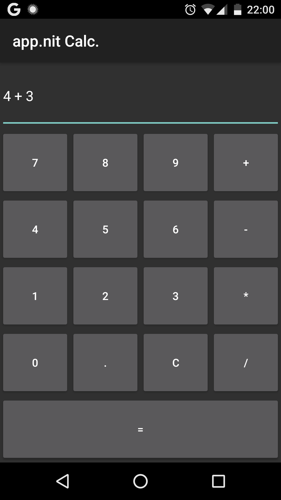
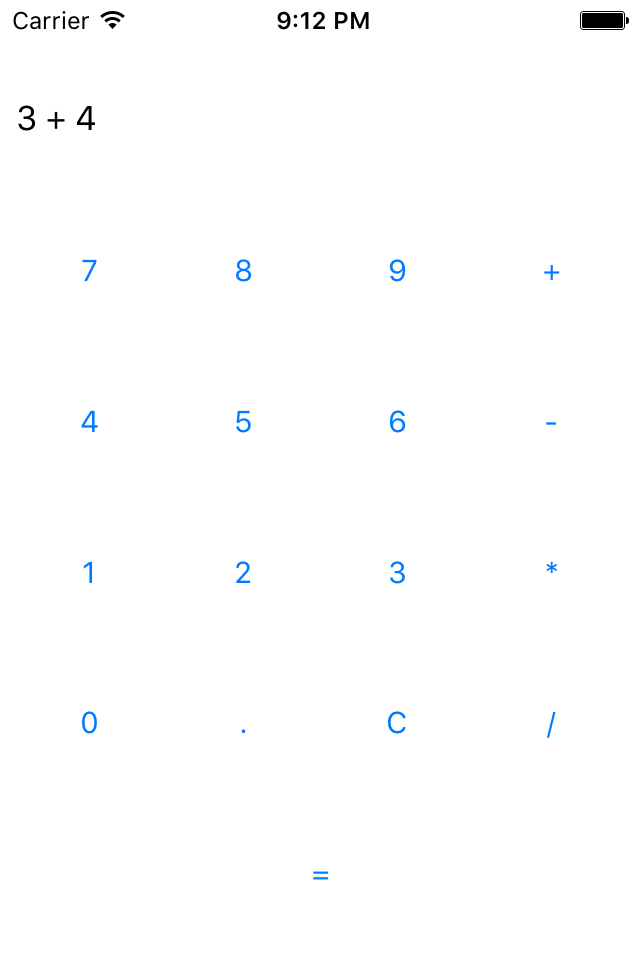
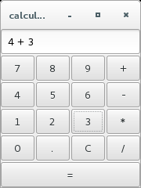
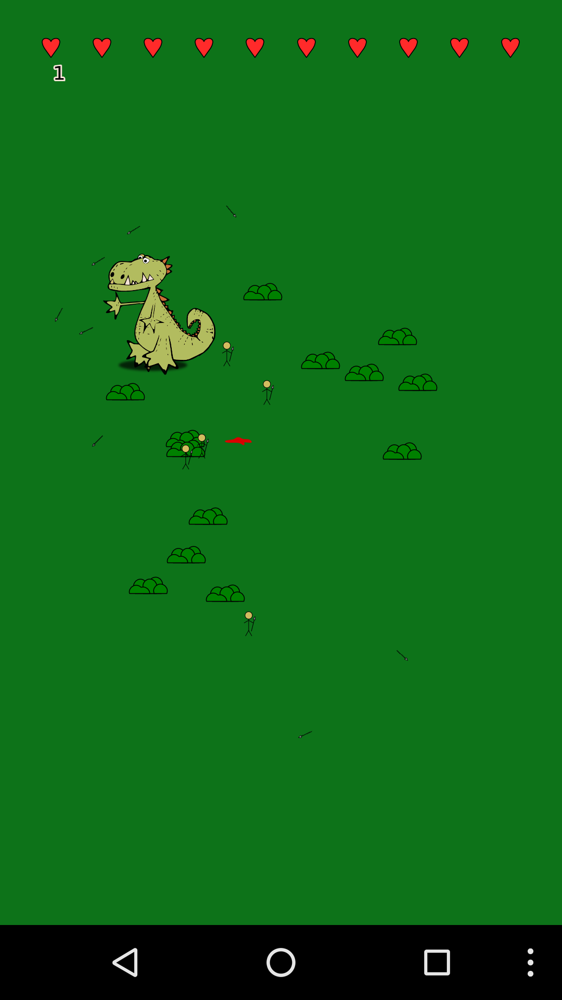
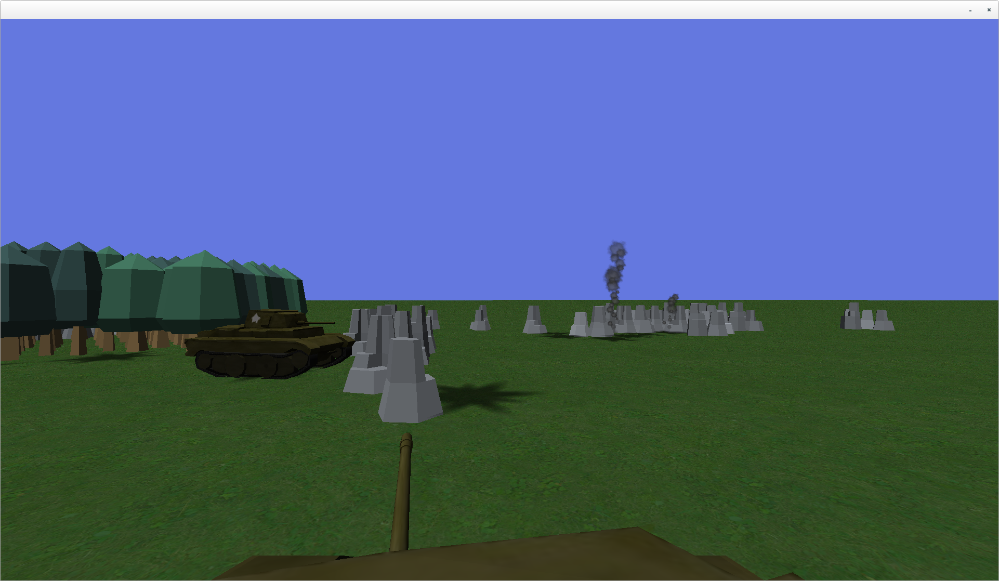

## Nit Philosophy

* Elegance: The theoretical concepts on which Nit is based should powerful and consistent
* Simplicity: KISS . Unnecessary complexity should be avoided
* Intutivity: POLA . The concepts and semantics of language constructs should seem natural to any programmer.

## Why a New Language?

* Difficult to integrate new core features in existing languages without breaking their ​​foundations
* Difficult to work on the foundations of existing languages ​​without breaking existing programs
* Difficult to find a programming language with modern objects, with useful static typing, with consistency in its specification.

## Class Refinement

Add things to existing classes:

* New methods
* New attributes
* Override methods
* New super-classes

~~~nit
redef class Int
   fun fib: Int do
      if self <= 2 then return self
      return (self - 1).fib + (self - 2).fib
   end
end
~~~

Class Refinement is

* Aspect-Oriented Programming,

  but without weaving issues.

* Monkey-patching,

  but statically checked.

## Concern-Oriented Development

Nit source files are called modules.
A module can define classes and methods, import them (by importing other modules), and refine them.

Since a single class can be refined by multiple modules, Nit promotes Concern-Oriented Development where each module ideally operates on a single concern.
A Nit program is just a module that imports all the required concerns.

Moreover, importation of modules can be done and configured at link-time (with `-m` and `-D`) to generate specific configurations of a product line.

## Multiple Inheritance

> TODO?

## Easy Accessors and Constructors

Just define attributes in classes to have automatic accessors and constructors.

~~~nit
class Foo
   # The real `foo` attribute is strongly encapsulated.
   # only accessors are available
   var attr: Int
end
var foo = new Foo(10)
print foo.attr # `attr` is in fact a genuine method
~~~

Extends each attribute with additional information. 

~~~nit
class Foo
   var i: Int # Should be initialized during the construction
   var j: Int = 10 # Initialized with 10
   var k: Int = 10.factorial is lazy # Only initialized at the first call
end
~~~

## Adaptive Typing

Nit features **Adaptive Typing**, a statically and control-flow dependent type inference mechanism where the static type of local variables is automatically adapted using the static information of assignments, loops, breaks, conditionals, equality tests and type checks.

~~~nit
var a
a = "Hello" # `a` is a `String`
print a.to_upper
a = 5 # `a` is an `Int`
print a.fib
a = a.to_s # `a` is a `Sring` again
~~~

### Nullable types

Nit features **nullable types** to statically control the escape of dangerous `null` values.
Safe and unsafe constructions are automatically distinguished by the adaptive typing: expressiveness and safety is maximal while verbosity is minimal.

~~~nit
var a = "hello".search("ll")
# `a` is a `nullable Match`
print a #
#     ^ Error: expected a non-nullable value.
if a != null then print a # OK, thanks to adaptive typing.
~~~

## Generics and Virtual Types

> TODO

## Polyglot

Nit can glue together multiple languages.

~~~nit
fun in_nit do print "In Nit"
fun in_c `{ printf("In C\n"); `}
fun in_cpp in "C++" `{ cout << "In C++" << endl; `}
fun in_java in "Java" `{ System.out.println("In Java"); `}
fun in_objc in "ObjC" `{ NSLog (@"In Objective C\n"); `}
~~~

## Compiler

`nitc` is the Nit compiler. It has options to produce highly-optimized executables.

> What to say?

See <http://nitlanguage.org/tools/nitc.html>

## Interpreter

`nit` is the Nit interpreter.

It can be used in an interpreter directive to directly execute programs.

~~~nit
#!/usr/bin/env nit
print "hello world"
~~~

It can also be used as a command-line multi-tool.

~~~
$ nit -e 'import crypto; print "Uryyb, Jbeyq!".rot(13)'
Hello, World!
~~~

See <http://nitlanguage.org/tools/nit.html>

## Other Tools

* `nitdoc` documentation generator
* `nitunit` unit tester
* `nitpick` code checker
* and others (`nitmetrics`, `nitlight`, `nitserial`, `nitls`, `nitpretty`, `nitx`, `nitlight`)

See <http://nitlanguage.org/tools/>

## Programs and Libraries

On 26/02/2016, the catalog of Nit count

* 149 packages
* 11 maintainers
* 37 contributors
* 32 tags
* 934 modules
* 10,005 classes
* 54,186 methods
* 320,143 lines of code

See <http://nitlanguage.org/catalog/>

## Multi-platform

app.nit provide an abstraction of the common needs of modern applications on multiple platforms: Native GTK, OS X, Android and iOS (YMMV).

> Screenshots for gtk, android, ios

* 
* 
* 

See <http://nitlanguage.org/catalog/p/app.html>

## Game Development

`gamnit` is a portable game and multimedia framework for Nit

Gamnit is a modular framework to create portable 2D or 3D apps in Nit. It is based on the portability framework app.nit and the OpenGL ES 2.0 standard.

* 
* 
* 
See <http://nitlanguage.org/catalog/p/gamnit.html>

## Web Development

`nitcorn` is a lightweight framework for Web applications.

> Talk about projects

See <http://nitlanguage.org/catalog/p/nitcorn.html>

## Get involved

> TODO

* Get Involved: <http://nitlanguage.org/internal/>
* Github: <https://github.com/nitlang/nit>
* Gitter: <https://gitter.im/nitlang/nit>
